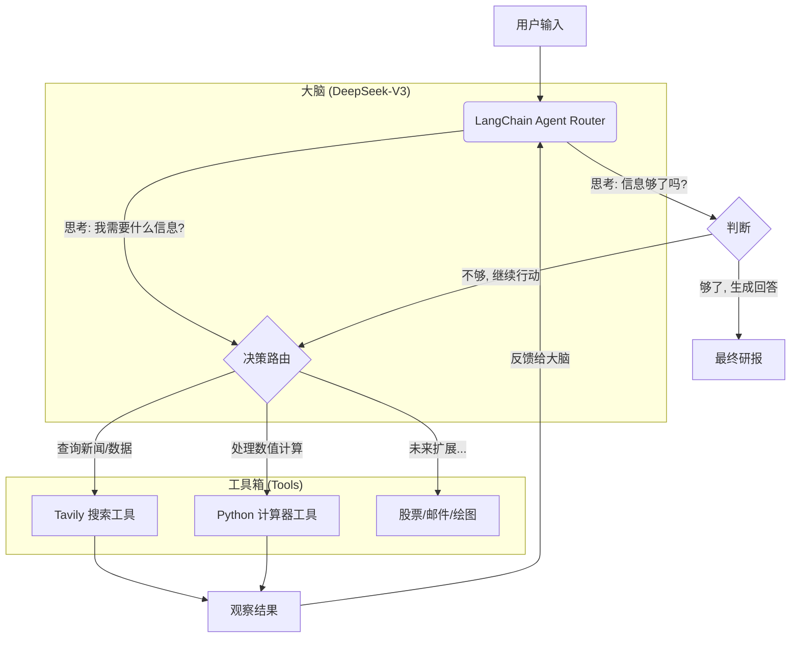

# 🕵️‍♂️ DeepResearch Agent: 全网深度研报生成器


> **并不是所有的 AI 都只会聊天。**
> 这是一个基于 **ReAct (Reasoning + Acting)** 架构的 AI 智能体。它不仅能对话，还能**自主联网搜索、阅读网页、分析数据**，并最终生成一份有理有据的深度研究报告。

---

## 📸 项目演示 (Demo)


*(上图展示了 Agent 的思考过程：搜索 -> 阅读 -> 总结)*

---


## 📖 核心原理 (What I Learned)

本项目不仅仅是调用 API，而是实现了 **AI Agent (智能体)** 的核心架构。在开发过程中，我深入研究了以下三个关键概念：

### 1. Agent vs. Chatbot 的区别
* **Chatbot (如 ChatGPT)**：是**被动**的。它利用训练数据里的知识回答你，如果它不知道（比如今天的新闻），它就会产生幻觉。
* **Agent (本项目)**：是**主动**的。当它发现自己不知道时，它会去调用“工具”获取信息。它是 **大脑 (LLM) + 双手 (Tools)** 的结合体。

### 2. ReAct 模式 (推理与行动)
本项目采用了 **ReAct (Reasoning + Acting)** 范式。AI 的执行流程不再是黑盒，而是：
1.  **Thought (思考)**：用户问了这个问题，我需要搜索吗？
2.  **Action (行动)**：调用 `web_search` 工具，关键词是什么？
3.  **Observation (观察)**：读取搜索引擎返回的摘要。
4.  **Answer (回答)**：根据搜索结果生成最终答案。

### 3. Function Calling (函数调用)
DeepSeek V3 模型具备“函数调用”能力。它不会直接执行 Python 代码，而是返回一个 JSON 结构：
`{"tool": "web_search", "args": {"query": "DeepSeek V3 评测"}}`
然后由 LangChain 框架拦截这个指令，执行 Python 函数，再把结果喂回给 LLM。

---


## 🏗️ 技术架构



- **大脑 (LLM)**: DeepSeek-V3 (兼容 OpenAI 协议)

- **双手 (Tools)**: Tavily Search API (专为 AI 优化的搜索引擎)

- **编排 (Orchestration)**: LangChain (负责 Prompt 管理和工具调度)

- **前端 (UI)**: Streamlit + StreamlitCallbackHandler (可视化思考过程)


## 🧠 深度解析：多工具智能调用原理
本项目最核心的价值在于 Agent 如何在多个工具中进行 **"合理调用" (Intelligent Routing)**。
### 1. 场景案例：复合任务处理
当用户问：**“小米 SU7 的起售价是多少？如果首付 30%，我需要付多少钱？”**
普通 AI 只能回答价格，或者算错数。而本项目的 Agent 会执行以下 **思维链 (Chain of Thought)**：
1. **思考 1**: 我不知道小米 SU7 的价格。 -> 决定调用 search_tool。
2. **观察 1**: 搜索结果显示起售价为 21.59 万。
3. **思考 2**: 用户问首付 30%，即 215900 * 0.3。我自己算容易出错。 -> 决定调用 calculator_tool。
4. **观察 2**: 计算结果为 64770。
5. **最终回答**: “小米 SU7 起售价 21.59 万，首付 30% 需支付 64770 元。”

### 2. 代码实现：如何教会 AI 使用工具？
秘诀在于 Python 函数的 **Docstring (文档注释)**。LangChain 会把这些注释作为“工具说明书”喂给大模型。


**原理总结**：DeepSeek V3 具备强大的语义理解能力，它会对比“用户问题”和“工具说明书”，选择匹配度最高的工具。


## 💻 核心代码解析

### 1. 定义工具 (The "Hands")
我们使用 `@tool` 装饰器把普通的 Python 函数变成了 AI 能理解的工具。**Docstring (注释) 非常重要**，AI 靠它来理解何时使用这个工具。
```python
@tool
def search_tool(query: str):
    """
    当需要获取实时信息、新闻、具体数据或你不知道的知识时，使用此工具。
    输入应该是具体的搜索关键词。
    """
    return web_search(query)
```

### 2. 组装智能体 (The "Brain")
使用 LangChain 的 `create_tool_calling_agent` 将 LLM、工具箱和 Prompt 结合在一起。
```python
# 核心逻辑：让 LLM 知道它有哪些工具可以用
agent = create_tool_calling_agent(llm, tools, prompt)

# 执行器：负责 "思考-执行-反馈" 的循环
agent_executor = AgentExecutor(agent=agent, tools=tools,verbose=True)
# 🔥 开启 verbose，你能在终端看到它思考的全过程！
```

### 3. 可视化思考过程
为了让用户看到 AI 没在偷懒，我们使用了 `StreamlitCallbackHandler`，它能把后台的日志渲染成前端漂亮的折叠框。
```python
st_callback = StreamlitCallbackHandler(st.container())
response = agent_executor.invoke(
    {"input": prompt},
    {"callback": [st_callback]} # 注入回调，实现可视化
)
```

## 🚀 运行项目

### 1. 克隆仓库
```bash
git clone [https://github.com/rgnp/DeepResearch-Week3.git](https://github.com/rngp/DeepResearch-Week3.git)
cd DeepResearch-Week3
```

### 2. 环境配置
```bash
# 创建虚拟环境
python -m venv venv
Windows: .venv\Scripts\activate

# 安装依赖
pip install -r requirements.txt
```

### 3. 配置密钥
在根目录新建`.env`文件：
```bash
DEEPSEEK_API_KEY=sk-xxxxxx
DEEPSEEK_BASE_URL=[https://api.deepseek.com](https://api.deepseek.com)
TAVILY_API_KEY=tvly-xxxxxx
```

### 4. 启动项目
```bash
streamlit run src/app.py
```
---

## 🔮 武器库扩展思路 (Future Roadmap)
掌握了 Tool Calling 原理后，我们可以无限扩展 Agent 的能力：
- 📈 **金融分析师**: 集成 yfinance 工具，直接拉取股票 K 线数据进行分析。
- 📊 **数据科学家**: 集成 pandas 工具，允许用户上传 Excel，Agent 自动写代码画图。
- 📧 **办公助手**: 集成 Gmail API，自动帮用户撰写并发送邮件。


---
> Created by [RGNP] - A Computer Science Graduate Student exploring AI Engineering.