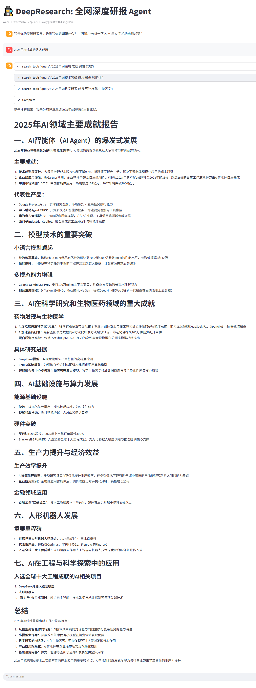

# 🕵️‍♂️ DeepResearch Agent: 全网深度研报生成器


> **并不是所有的 AI 都只会聊天。**
> 这是一个基于 **ReAct (Reasoning + Acting)** 架构的 AI 智能体。它不仅能对话，还能**自主联网搜索、阅读网页、分析数据**，并最终生成一份有理有据的深度研究报告。

---

## 📸 项目演示 (Demo)


*(上图展示了 Agent 的思考过程：搜索 -> 阅读 -> 总结)*

---

## 📖 核心原理 (What I Learned)

本项目不仅仅是调用 API，而是实现了 **AI Agent (智能体)** 的核心架构。在开发过程中，我深入研究了以下三个关键概念：

### 1. Agent vs. Chatbot 的区别
* **Chatbot (如 ChatGPT)**：是**被动**的。它利用训练数据里的知识回答你，如果它不知道（比如今天的新闻），它就会产生幻觉。
* **Agent (本项目)**：是**主动**的。当它发现自己不知道时，它会去调用“工具”获取信息。它是 **大脑 (LLM) + 双手 (Tools)** 的结合体。

### 2. ReAct 模式 (推理与行动)
本项目采用了 **ReAct (Reasoning + Acting)** 范式。AI 的执行流程不再是黑盒，而是：
1.  **Thought (思考)**：用户问了这个问题，我需要搜索吗？
2.  **Action (行动)**：调用 `web_search` 工具，关键词是什么？
3.  **Observation (观察)**：读取搜索引擎返回的摘要。
4.  **Answer (回答)**：根据搜索结果生成最终答案。

### 3. Function Calling (函数调用)
DeepSeek V3 模型具备“函数调用”能力。它不会直接执行 Python 代码，而是返回一个 JSON 结构：
`{"tool": "web_search", "args": {"query": "DeepSeek V3 评测"}}`
然后由 LangChain 框架拦截这个指令，执行 Python 函数，再把结果喂回给 LLM。

---

## 🏗️ 技术架构

```mermaid
graph LR
    A[用户输入] --> B(LangChain Agent)
    B --> C{大脑: DeepSeek V3}
    C -- 需要外部信息 --> D[工具: Tavily Search]
    D -- 返回网页摘要 --> C
    C -- 信息充足 --> E[生成最终研报]
    E --> F[Streamlit 前端展示]

## 🚀 运行项目

### 1. 克隆仓库
```bash
git clone [https://github.com/rgnp/DeepResearch-Week3.git](https://github.com/rngp/DeepResearch-Week3.git)
cd DeepResearch-Week3
```

### 2. 环境配置
```bash
# 创建虚拟环境
python -m venv venv
Windows: .venv\Scripts\activate

# 安装依赖
pip install -r requirements.txt
```

### 3. 配置密钥
在根目录新建`.env`文件：
```bash
DEEPSEEK_API_KEY=sk-xxxxxx
DEEPSEEK_BASE_URL=[https://api.deepseek.com](https://api.deepseek.com)
TAVILY_API_KEY=tvly-xxxxxx
```

### 4. 启动项目
```bash
streamlit run src/app.py
```

Created by [RGNP] - A Computer Science Graduate Student exploring AI Engineering.